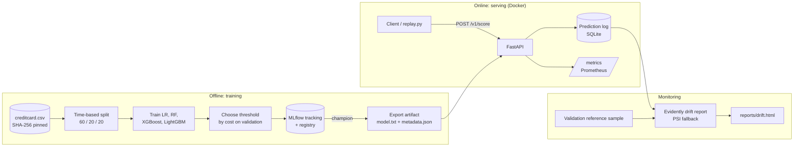

# CardShield

[](https://github.com/himaallu/CardSheild/actions/workflows/ci.yml)

A real-time card-fraud scoring service with the full MLOps loop around it: a LightGBM model
trained on a time-based split with a cost-optimised threshold, MLflow tracking and registry,
a FastAPI service that explains every decision, a prediction log, drift monitoring, Docker
and CI.

On the held-out test period it cuts the total cost of fraud by **65%** compared with the best
amount rule, catching 80% of fraud at a p95 latency of **13 ms** per request.

## Problem

Card fraud cost the world $33.41 billion in 2024 and is projected to reach $41.06 billion by
2030 ([Nilson Report, Jan 2026](https://www.streetinsider.com/Press+Releases/Global+Card+Fraud+Losses+at+%2433+Billion/25819121.html)).
A bank or payment processor has a few milliseconds per payment to decide whether it looks
fraudulent, and a wrong decision costs money either way:

- **Missed fraud** loses the full transaction amount.
- **False alarms** block a genuine customer and cost analyst review time.
- **Silent decay**: fraudsters change tactics, so a model that works today slowly stops
  working, and nobody notices until losses rise.
- **No explanation**: analysts need to know *why* a payment was flagged before they can act.

Simple rules such as "flag anything over a fixed amount" are cheap but blunt: they block
genuine large purchases and miss small fraudulent ones.

## Objective

Minimise the **total cost of fraud**, money lost to missed fraud plus the cost of reviewing
false alarms, while staying fast enough to sit in the payment flow, explaining every decision,
and raising an alarm when the incoming traffic stops looking like the data the model was
built on.

| Goal | Target | Result |
| --- | --- | --- |
| Lower total fraud cost | Clearly below approve-all and the amount rule | **65.2%** below the amount rule, **65.7%** below approve-all |
| Catch fraud | Report recall with the precision it costs | Recall **0.80** at precision **0.55** |
| Fit in the payment flow | p95 < 50 ms per transaction | **13.3 ms** |
| Explain every decision | Top 3 reasons on 100% of responses | Yes, from LightGBM's native SHAP values |
| Detect model decay | Simulated drift flagged, normal traffic not | **3/29** features on drifted traffic, **0/29** on normal |
| Reproducible models | Every model traceable to data, params and metrics | MLflow run + SHA-256 data hash for every model |

## Results

All numbers come from the **test period**, the last 20% of the data by time (56,962
transactions, 75 frauds), which was used once, for this report. The threshold and the amount
rule were both chosen on the validation period.

### Cost saved

A missed fraud costs its amount; a false alarm costs a review of 5. Amounts are in the
dataset's own currency units (the source doesn't name the currency).

| Policy | Total cost on the test period | Saved by the model |
| --- | ---: | ---: |
| Approve everything | 7,729.26 | 65.7% |
| Best amount rule (block ≥ 1,335, tuned on validation) | 7,604.33 | 65.2% |
| **CardShield model** (threshold 0.029) | **2,647.79** | — |

The model catches 60 of the 75 frauds and raises 50 false alarms (250 of review cost); the
15 frauds it misses add up to 2,397.79.

### Model metrics

Test period, at the cost-optimised threshold:

| Metric | Value |
| --- | ---: |
| **PR-AUC** (primary) | **0.800** |
| ROC-AUC | 0.968 |
| Recall | 0.800 |
| Precision | 0.545 |
| F1 | 0.649 |

Four models were compared on the **validation** period (test was never used to choose):

| Model | Validation PR-AUC | Validation cost |
| --- | ---: | ---: |
| Logistic regression | 0.773 | 4,497 |
| Random forest | 0.767 | 4,242 |
| XGBoost | 0.791 | 4,105 |
| **LightGBM** (champion) | **0.796** | **3,970** |

LightGBM won on both measures and its native SHAP contributions give explanations at no extra
cost.

### Latency

`make bench` against the local API (Linux container, model loaded once at startup, every
request also writes to the prediction log):

| Scenario | p50 | p95 | p99 | Throughput |
| --- | ---: | ---: | ---: | ---: |
| Single request, concurrency 1 | 10.3 ms | **13.3 ms** | 14.9 ms | 94 req/s |
| Single request, concurrency 8 | — | 36.8 ms | — | 311 req/s |
| Batch of 100 transactions | — | 224 ms | — | ~470 tx/s |

### Drift demo

`make replay` sends 2,000 normal test-period payments through the API; `make drift` then
compares them with a sample of the validation period: **0/29 features drifted**.
`make replay-drift` sends the same traffic but, halfway through, triples `Amount` and shifts
`V14` and `V17` by two standard deviations. `make drift` flags exactly those three:

```
Drift [evidently]: 3/29 features drifted (10%): Amount, V14, V17
```


## Architecture



**API**

| Endpoint | Does |
| --- | --- |
| `POST /v1/score` | One transaction in; `fraud_probability`, `decision` (block / approve), `threshold`, `model_version`, top 3 `reasons`, `latency_ms` out |
| `POST /v1/score/batch` | Up to 1,000 transactions |
| `GET /healthz` | Model loaded and its version |
| `GET /metrics` | Prometheus: request count, latency histogram, decisions |

Example response for a real fraud from the test period (a payment of 1.18), rounded for reading:

```json
{
  "fraud_probability": 0.99997,
  "decision": "block",
  "reasons": [
    {"feature": "V14", "value": -9.15, "contribution": 4.76},
    {"feature": "V4", "value": 6.01, "contribution": 4.24},
    {"feature": "V12", "value": -6.15, "contribution": 2.78}
  ],
  "threshold": 0.0289,
  "model_version": "1",
  "latency_ms": 8.1
}
```

## Run it

You need Python 3.12 and, for `make up`, Docker. About 150 MB of data is downloaded.

```bash
git clone https://github.com/himaallu/CardSheild.git
cd CardSheild
python3.12 -m venv .venv && source .venv/bin/activate
make install      # pinned dependencies + dev tools
make data         # download the dataset, check its SHA-256, 284,807 rows and 492 frauds
make train        # train 4 models, log to MLflow, register the champion, export it
make serve        # API on http://localhost:8000/docs
```

No Python 3.12? With [uv](https://docs.astral.sh/uv/) (works well on Apple Silicon):

```bash
uv venv --python 3.12 .venv && source .venv/bin/activate
uv pip install -e ".[train,monitor,dev]"
```

Then, with `make serve` running, in a second terminal (activate the venv again):

```bash
make replay        # stream 2,000 normal test-period payments
make drift         # -> 0/29 features drifted
make replay-drift  # stream 2,000 payments, drifted halfway through
make drift         # -> 3/29 features drifted: Amount, V14, V17
open reports/drift.html   # macOS; use xdg-open on Linux
make bench         # latency benchmark
```

Or run the API and the MLflow UI in Docker (after `make train`):

```bash
make up    # API http://localhost:8000/docs, MLflow UI http://localhost:5001
make down
```

The MLflow UI is on port 5001 because macOS AirPlay already uses 5000.

Checks: `make test` (50 tests, no dataset needed, synthetic fixture) and `make lint` (ruff +
strict mypy). CI runs both and builds, starts and health-checks the Docker image on every
pull request and push to `main`.

> Retraining on a different CPU (e.g. Apple Silicon vs x86) gives the same decisions and
> reasons but slightly different decimals (threshold 0.0281 vs 0.0289), because floating-point
> sums differ between architectures. Results are exactly repeatable on the same machine.

## Key design decisions

1. **Split by time, not at random.** Fraud patterns change over time. A random split lets the
   model learn from the "future" and inflates scores. Train on the first 60%, choose the
   threshold on the next 20%, report on the last 20%; cut points move past tied timestamps.
2. **PR-AUC, not accuracy.** Only 0.17% of payments are fraud, so a model that never says
   "fraud" is 99.8% accurate. PR-AUC measures how well the rare class is found.
3. **Threshold set by cost, not 0.5.** A missed fraud costs its amount; a false alarm costs 5.
   The threshold that minimises that total on validation is 0.029, far below 0.5, because
   missing fraud is much more expensive than a review.
4. **Compare against a real baseline.** The model is judged against what a business would do
   without it: approve everything, or block above an amount tuned on validation.
5. **Registry for lineage, fixed artifact for serving.** MLflow records how every model was
   made (params, metrics, plots, data hash). The container serves an exported `model.txt` +
   `metadata.json`, so serving never depends on the MLflow server, and feature order comes
   from the metadata, never from JSON key order.
6. **Native SHAP reasons.** LightGBM's `pred_contrib` gives per-feature contributions in about
   the time of a prediction, so every response carries its top 3 reasons without an extra
   library.
7. **Log every prediction; compare drift with validation, not training.** Drift can only be
   measured on what the model actually saw. A training-period reference flagged 24/29
   features on perfectly normal test traffic, because the V features vary by time of day, so
   the reference is the validation period, the most recent data the model was checked on.
8. **Fallbacks over fights.** If Evidently fails, a hand-written PSI per feature gives the same
   one-line summary.

## Limitations

- **Anonymised features.** V1–V28 are PCA components, so no domain features (merchant,
  device, velocity, customer history) can be built. This is a demonstration of the MLOps loop,
  not a production fraud model.
- **Small, short test set.** The data covers two days in September 2013, and the test period
  has only 75 frauds. One fraud more or less caught moves recall by 1.3 points, so treat the
  metrics as indicative.
- **Fixed review cost.** 5 per false alarm is an assumption; a real business would plug in
  its own costs (and chargeback fees), which would move the threshold.
- **Simulated drift.** The drift demo injects a known shift. The PSI fallback misses the
  `Amount` change (PSI ≈ 0.08, below the 0.2 alarm level); Evidently catches it.
- **Single process.** SQLite and one API process suit a demo. Production would need a proper
  log store, horizontal scaling, authentication and automated retraining.

## Repo layout

```
src/cardshield/
  config.py  data.py  threshold.py  train.py  export.py
  serve/        app.py  schemas.py  model.py  store.py
  monitoring/   drift.py
scripts/        download_data.py  replay.py  bench.py
tests/          synthetic fixture + 50 tests
artifacts/model/  exported champion (model.txt + metadata.json)
docs/           PRD.md  IMPLEMENTATION_PLAN.md  drift.png
```

Spec: [docs/PRD.md](docs/PRD.md) · Sprint plan: [docs/IMPLEMENTATION_PLAN.md](docs/IMPLEMENTATION_PLAN.md)

Dataset: [ULB Credit Card Fraud Detection](https://www.kaggle.com/datasets/mlg-ulb/creditcardfraud)
(Dal Pozzolo et al.), downloaded from the TensorFlow mirror.
