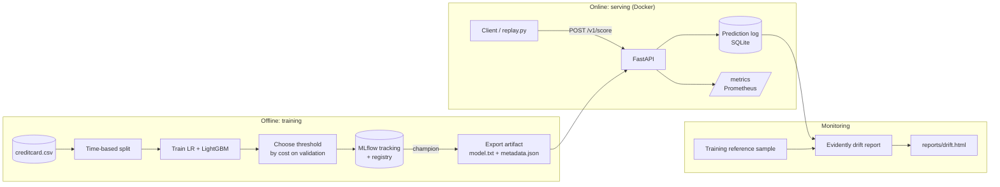

# CardShield — Product Requirements Document

CardShield stops fraudulent card payments before they go through, without blocking genuine
customers, and tells the business when its fraud model can no longer be trusted.

**Build budget:** 2 hours with Claude Code. P0 must ship; P1 only if time remains.

---

## 1. Problem

Card fraud is a large, persistent cost for everyone in the payment chain. Worldwide losses
were $33.41 billion in 2024 and are projected to reach $41.06 billion by 2030
([Nilson Report, Jan 2026](https://www.streetinsider.com/Press+Releases/Global+Card+Fraud+Losses+at+%2433+Billion/25819121.html)).
Those losses fall on card issuers, merchants and payment processors.

A bank, BNPL provider or payment processor has to decide on every transaction, in the few
milliseconds before it is approved, whether it looks fraudulent. Getting that decision wrong
costs money in both directions:

- **Missed fraud.** The full transaction amount is lost, plus chargeback fees and the cost of
  replacing the card. The customer loses trust.
- **False alarms.** A genuine customer's payment is blocked or sent for manual review. Each
  review costs analyst time, and customers who are declined by mistake often abandon the
  purchase or the card.
- **Silent decay.** Fraudsters change tactics, so a model that works today degrades over the
  following months. Without monitoring, nobody notices until losses rise.
- **No explanation.** Analysts and auditors need to know *why* a payment was flagged before
  they can act on it or defend the decision to a customer.

Simple rules ("flag anything over a fixed amount") are cheap but blunt: they block many
genuine large purchases and miss small fraudulent ones.

## 2. Objective

Give a payment platform a fraud scoring service that **minimises the total cost of fraud**,
the money lost to missed fraud plus the cost of reviewing false alarms, while staying fast
enough to sit in the payment flow and transparent enough for analysts to trust.

**Measurable goals for this version**

| Goal | Measure | Target |
| --- | --- | --- |
| Lower total fraud cost | Cost on the held-out test period vs (a) approving everything and (b) an amount-threshold rule | Clearly lower than both; report the % saved |
| Catch fraud | Recall at the chosen threshold | Report it, with the precision it costs |
| Fit in the payment flow | p95 latency per transaction | < 50 ms |
| Explain every decision | Top 3 reasons returned with each score | 100% of responses |
| Detect model decay | Drift alert on shifted traffic | Simulated drift flagged; normal traffic not |
| Reproducible models | Every model traceable to its data, parameters and metrics | 100% of registered models |

## 3. Users

| User | Need |
| --- | --- |
| Payments system (machine client) | Score a transaction in milliseconds; get a decision and a reason |
| Fraud analyst | See why a transaction was flagged; trust the threshold |
| ML engineer (owner) | Reproduce training, compare runs, promote models, know when the model is going stale |

## 4. Data

**Dataset:** ULB "Credit Card Fraud Detection" (European cardholders, September 2013).
284,807 transactions over two days, 492 frauds (about 0.17%).

- Columns: `Time` (seconds since the first transaction), `Amount`, `V1`–`V28`
  (anonymised PCA components), `Class` (1 = fraud).
- Download: the original CSV from the TensorFlow mirror
  (`storage.googleapis.com/download.tensorflow.org/data/creditcard.csv`, no login, SHA-256
  pinned) or Kaggle (`mlg-ulb/creditcardfraud`). OpenML `data_id=1597` has identical values
  but drops `Time`, so it can't support the time-based split. The download script must verify
  284,807 rows and 492 frauds.
- The raw CSV is never committed.

**Honest limitation (state it in the README):** V1–V28 are anonymised PCA features, so no
domain feature engineering is possible and the model is a demonstration of the MLOps loop,
not a production fraud model.

## 5. Requirements

### Training (P0)

| ID | Requirement |
| --- | --- |
| T1 | Time-based split: first 60% of rows by `Time` = train, next 20% = validation, last 20% = test. No shuffling across the boundary. |
| T2 | Baseline logistic regression plus LightGBM with class-imbalance handling (`scale_pos_weight`). |
| T3 | Primary metric: PR-AUC (average precision). Also log ROC-AUC, precision, recall and F1 at the chosen threshold. |
| T4 | Threshold chosen on the validation set by minimising cost: a missed fraud costs its `Amount`; a false alarm costs a fixed review cost (default 5). Never tuned on test. |
| T5 | Every run logged to MLflow: params, metrics, PR curve image, confusion matrix, feature list, threshold, data hash. |
| T6 | Best LightGBM run registered as model `cardshield`, alias `champion`. |
| T7 | Champion exported to `artifacts/model/` as `model.txt` + `metadata.json` (feature order, threshold, model version, run id, test metrics, training date). The API serves this artifact. |
| T8 | Business impact on the test period: total cost (missed-fraud amounts + review cost × false alarms) for three policies: approve everything, the best single amount-threshold rule (tuned on validation), and the model. Logged to MLflow and printed as a table. |

### Serving (P0)

| ID | Requirement |
| --- | --- |
| S1 | `POST /v1/score`: one transaction in, `{fraud_probability, decision, threshold, model_version, reasons[top 3], latency_ms}` out. |
| S2 | `POST /v1/score/batch`: up to 1,000 transactions. |
| S3 | Strict Pydantic validation: all 30 features required, `Amount ≥ 0`, unknown fields rejected (422). |
| S4 | Reasons from LightGBM native SHAP contributions (`predict(..., pred_contrib=True)`); no extra SHAP library at serve time. |
| S5 | Every scored request appended to a prediction log (SQLite): features, probability, decision, model version, timestamp. |
| S6 | `GET /healthz` (model loaded, version) and `GET /metrics` (Prometheus: request count, latency histogram, decisions by class). |
| S7 | Model loaded once at startup; p95 latency for single requests under 50 ms locally. |

### Monitoring (P0)

| ID | Requirement |
| --- | --- |
| M1 | `scripts/replay.py` streams test-set rows to the API; `--drift` mode multiplies `Amount` by 3 and shifts two V features for the second half to simulate drift. |
| M2 | `make drift` builds an Evidently data-drift report comparing a reference sample from the **validation** period to the logged traffic (a training-period reference flagged 24/29 features on normal test traffic, because the V features vary by time of day; `Time` itself is excluded); saves HTML to `reports/` and prints a one-line summary (share of drifted features). |
| M3 | If the installed Evidently API misbehaves, fall back to a hand-written PSI per feature with the same summary output. Don't burn time fighting library versions. |

### Engineering (P0)

| ID | Requirement |
| --- | --- |
| E1 | Dockerfile for the API (slim Python image, non-root user, model artifact baked in) and `docker-compose.yml` with the API and the MLflow UI. |
| E2 | GitHub Actions: ruff, pytest, docker build on every push and pull request. |
| E3 | Tests run without the full dataset: a small synthetic fixture with the same schema. |
| E4 | `scripts/bench.py`: async load test reporting p50/p95/p99 latency and requests per second. |
| E5 | README: problem, architecture diagram, metrics table (real numbers from the run), latency table, drift demo screenshot, how to run, limitations. |

### Nice to have (P1, only if P0 is done)

- ONNX export of the champion and a latency comparison (native vs ONNX).
- Locust load test file.
- Deploy the container to Render, Railway or Fly.io with a public `/docs` URL.
- Small live dashboard page showing flagged transactions as the replay runs.
- Champion/challenger promotion script: promote only if test PR-AUC improves.

### Out of scope

Real-time streaming infrastructure (Kafka), feature store, authentication, retraining
automation in the cloud, a full frontend.

## 6. System design



**Key design decisions:**

1. **Time-based split, not random.** Fraud patterns change over time; a random split leaks
   future behaviour into training and inflates scores.
2. **PR-AUC, not accuracy or ROC-AUC.** With 0.17% positives, a model that says "never fraud"
   is 99.8% accurate; PR-AUC focuses on the rare class.
3. **Cost-based threshold.** The business decides how many false alarms a missed fraud is
   worth; the threshold follows from that, chosen on validation only.
4. **Registry for lineage, immutable artifact for serving.** MLflow records how every model
   was made; the container ships a fixed exported artifact, so serving never depends on the
   MLflow server being up.
5. **Native SHAP contributions.** Explanations come from LightGBM itself in about the same
   time as a prediction, so every response carries its reasons.
6. **Log every prediction.** Drift can only be measured on what the model actually saw.

**Repo layout**

```
cardshield/
  src/cardshield/
    config.py            paths, constants, cost settings
    data.py              load, validate schema, time-based split
    train.py             train, evaluate, log to MLflow, register
    threshold.py         cost-based threshold search
    export.py            champion -> artifacts/model/
    serve/
      app.py             FastAPI app, routes, startup model load
      schemas.py         Pydantic request/response models
      model.py           artifact loading, predict, explain
      store.py           SQLite prediction log
    monitoring/
      drift.py           Evidently report (+ PSI fallback)
  scripts/
    download_data.py
    replay.py
    bench.py
  tests/
    conftest.py          synthetic fixture with the real schema
    test_data.py  test_threshold.py  test_api.py  test_model.py
  artifacts/model/       exported champion (committed: small)
  reports/               drift HTML (gitignored)
  data/                  raw CSV (gitignored)
  Dockerfile  docker-compose.yml  Makefile  pyproject.toml
  .github/workflows/ci.yml
  README.md  AGENTS.md  CLAUDE.md
```

**Make targets**

| Target | Does |
| --- | --- |
| `make data` | Download and verify the dataset |
| `make train` | Train, log to MLflow, register, export champion |
| `make serve` | Run the API locally on port 8000 |
| `make test` / `make lint` | pytest / ruff + mypy |
| `make replay` / `make replay-drift` | Stream test traffic (normal / drifted) |
| `make drift` | Build the drift report |
| `make bench` | Latency benchmark |
| `make up` | docker compose up (API + MLflow UI on port 5001; 5000 is taken by macOS AirPlay) |

## 7. Success criteria

- [ ] `make data && make train && make serve` works from a fresh clone.
- [ ] Test-period cost table shows the model beats both approve-all and the amount rule.
- [ ] MLflow UI shows at least 2 runs (LR, LightGBM) and a registered `champion`.
- [ ] `/v1/score` returns a decision with 3 reasons; invalid input returns 422.
- [ ] Bench shows p95 < 50 ms for single requests locally.
- [ ] Drift demo: normal replay shows little drift; `--drift` replay flags `Amount`.
- [ ] CI green; Docker image builds and serves.
- [ ] README has real metrics, latency, drift screenshot and the limitations note.

## 8. Resume bullet (fill in real numbers)

> Built CardShield, a real-time fraud scoring service that cut simulated fraud cost by __% vs an amount-threshold rule: LightGBM with time-based validation and
> cost-optimised threshold (PR-AUC __, recall __ at precision __), MLflow tracking and registry,
> FastAPI serving with per-prediction SHAP reasons at p95 __ ms, Evidently drift monitoring,
> Docker and GitHub Actions CI.
